# Shorten — rule-based links on CloudFront, DynamoDB and Rust on Lambda

An incognito link shortener. Anyone posts a URL and gets back a ten-character code and a management secret,
shown once. There is no account, no login and no personal data in the model.

A link carries an ordered list of rules, so a single short link can send an Android viewer in India to the
Play Store, an iPad in California to the App Store, and everybody else to the website. Clicks are counted
from CloudFront's own access logs by a nightly Athena rollup, never by a write in the request path. That is
what holds a redirect to exactly one DynamoDB read and keeps the whole thing inside the always-free tier.

The data model, the per-Lambda flows and every deliberate ceiling with its upgrade path are in
[`specs/01-dynamodb-data-model.md`](specs/01-dynamodb-data-model.md).

## Architecture



`diagrams/01-architecture-overview.mmd` is the source. Render it with
`mmdc -i diagrams/01-architecture-overview.mmd -o diagrams/01-architecture-overview.svg -b white`.

## Layout

The repository is a Rust workspace. One shared library crate holds the domain model and the storage code,
three small Lambda binaries call into it, and alongside them sit one CloudFront function, one HTML page and
the scripts that run the lot locally. The AWS resources are declared once, in the shared `aws-cloud`
repository, which this repository deploys into. There is no `infra/` directory here and no CDK anywhere.

The shared crate is organised by feature, not by layer. Everything about a link, a segment, a stats day or a
rate-limit counter lives in one file: its types, its rules, the shape of its row in the table, and the
`DynamoRepo` methods that read and write it. The low-level mechanics of the table live in `table.rs` and
nowhere else, so the storage rules can be checked in one place while the meaning of the data stays with each
feature.

```
crates/shared/src/table.rs      database core: the DynamoRepo handle, the shorten# key prefix, read/write primitives, jittered backoff
crates/shared/src/link.rs       the link row, the rule schema and its validation, and resolve(), the rule engine itself
crates/shared/src/segment.rs    the canonical {COUNTRY}|{REGION}|{PLATFORM}|{DEVICE} string and its parse
crates/shared/src/stats.rs      the daily stats row and the chunked BatchGetItem over a date window
crates/shared/src/ratelimit.rs  one counter row per IP per UTC day, advanced with ADD
crates/shared/src/code.rs       the 64-symbol alphabet, the 60-bit generator, and the charset fast-reject
crates/shared/src/secret.rs     the management secret: 32 CSPRNG bytes, hex SHA-256 stored, constant-time compare
crates/shared/src/url.rs        target URL validation: scheme, length, host shape, private and IP-literal refusals
crates/shared/src/error.rs      AppError and how each variant maps to an HTTP status and a wire code
crates/shared/src/http.rs       the JSON envelope every management response is built with
crates/shared/src/telemetry.rs  structured JSON logging and the CloudWatch embedded-metric helpers
crates/shared/src/testing.rs    test fixtures: a local table and sample links, rules and stats days
crates/shared/tests/            integration tests against DynamoDB Local
lambdas/redirect/               the default origin: GET /{code} to a 302, GET / to the embedded page
lambdas/mgmt/                   behind /api*: create, read, edit, delete a link, and read a stats window
lambdas/rollup/                 nightly: one Athena query for one day, then paced writes back into the table
edge/segment.js                 the viewer-request CloudFront function that derives the segment
edge/segment.test.mjs           its fixture harness, run with node --test
analytics/cloudfront_logs.sql   the Glue DDL and the rollup query, reproduced so a human can run them by hand
frontend/index.html             the page's markup; loads app.js as an ES module and nine stylesheets
frontend/app.js                 boot: the two tabs, then the create and manage panels
frontend/js/                    one module per job: api, dom, format, link, rules, stats, create, manage
frontend/styles/                nine stylesheets numbered in cascade order, @scope per component
frontend/serve.py               local only: serves the directory and proxies /api/* and /{code} the way CloudFront does
lambdas/redirect/build.rs       inlines frontend/ into the one page the redirect function serves from GET /
scripts/                        run it locally: the table, the functions, a seeded demo link, the frontend
qa/                             the scripts that test a deployed stack, and the cost report
```

Each Lambda is a `src/lib.rs` holding the handler, testable without a runtime, plus a thin `src/main.rs`
that is the `lambda_runtime` boundary and nothing else.

## Configuration

`aws-cloud` sets every variable below on each function. You only need to set them by hand when running a
Lambda outside that stack, for instance against DynamoDB Local.

| Variable           | Read by            | Purpose                                                                                                                            |
|--------------------|--------------------|------------------------------------------------------------------------------------------------------------------------------------|
| `TABLE_NAME`       | all three          | the shared DynamoDB table; every key is prefixed `shorten#`                                                                        |
| `METRIC_NAMESPACE` | all three          | CloudWatch namespace for embedded metrics; defaults to `shorten`                                                                   |
| `ORIGIN_VERIFY`    | `redirect`, `mgmt` | the value CloudFront sends as `X-Origin-Verify`; unset or empty skips the check                                                    |
| `PUBLIC_BASE_URL`  | `mgmt`             | the origin `short_url` is built from; falls back to the request host                                                               |
| `ATHENA_OUTPUT`    | `rollup`           | `s3://aws-cloud-athena-<account>/…`, where query results land                                                                      |
| `ATHENA_WORKGROUP` | `rollup`           | `aws-cloud-analytics`, which enforces the 1 GB per-query scan cap                                                                  |
| `GLUE_DATABASE`    | `rollup`           | `aws_cloud`                                                                                                                        |
| `GLUE_TABLE`       | `rollup`           | `cloudfront_logs`                                                                                                                  |
| `LOGS_BUCKET`      | nobody             | set by the platform for completeness; the rollup reaches the logs through Athena, and its role's S3 grant is what actually matters |

The AWS SDK reads its own settings from the environment: `AWS_REGION`, credentials, and
`AWS_ENDPOINT_URL_DYNAMODB` to point at a local endpoint instead of the real service.

### Two post-apply steps, both required

Neither of these fails loudly. The second one ships broken links with no error anywhere. Both live in the
`aws-cloud` repository's settings, not in this one.

| Where    | Name                      | Value                                                          |
|----------|---------------------------|----------------------------------------------------------------|
| secret   | `SHORTEN_ORIGIN_VERIFY`   | a long random string; can be set before the first apply        |
| variable | `SHORTEN_PUBLIC_BASE_URL` | `https://<distribution_domain>`, **set after the first apply** |

```bash
gh secret set SHORTEN_ORIGIN_VERIFY -R poly-glot/aws-cloud --body "$(openssl rand -base64 32)"
gh variable set SHORTEN_PUBLIC_BASE_URL -R poly-glot/aws-cloud --body "https://d111111abcdef8.cloudfront.net"
```

The first is an ordinary secret. The second cannot be set before the first apply, because it is the
distribution's own address, and threading that back into a function's environment would be a dependency
cycle: environment, then function, then function URL, then distribution, then distribution domain. So the
first apply runs with it empty, the `site_url` in the `apps` output names the distribution, and a second
apply gives `shorten-mgmt` the value.

**Miss it and everything appears to work.** `POST /api/links` returns `short_url`, the link the user copies.
With `PUBLIC_BASE_URL` empty the function falls back to the request host, which behind the `/api*`
behaviour's managed AllViewerExceptHostHeader policy is the `*.lambda-url.*.on.aws` origin, not the
distribution. Links handed out in that window bypass CloudFront altogether: no cache, no `s=` segment, no
access log line, so no analytics, and nothing errors. Treat any link created before the second apply as
disposable. `qa/02-edge-cache.sh` asserts that `short_url` names the distribution, which is the cheapest way
to catch it.

## How a redirect works

This is the product, so here is one request all the way through. A viewer opens
`https://d111111abcdef8.cloudfront.net/aB3xK9mQ2p` on an Android phone in Maharashtra.

### 1. CloudFront picks the behaviour

The path is not `/api*`, so it is the default behaviour, whose origin is the `shorten-redirect` function URL
rather than a bucket. `default_root_object` is deliberately unset. An `index.html` default would rewrite
`GET /` at the edge before the function ever saw it, and the page it went looking for does not exist, because
the function carries the page inside its own binary.

### 2. The viewer-request function runs, before the cache lookup

`shorten-segment` is this repository's `edge/segment.js`, published over a placeholder committed by
`aws-cloud`. It reads the CloudFront device and geolocation headers case-insensitively and builds one string:

```
{COUNTRY}|{REGION}|{PLATFORM}|{DEVICE}     →     IN|MH|android|mobile
```

Country is `CloudFront-Viewer-Country` if it matches two uppercase letters, otherwise `XX`. Region is
`CloudFront-Viewer-Country-Region`, one to three uppercase alphanumerics, otherwise `XX`. Platform is
`android` if `CloudFront-Is-Android-Viewer` is `true`, else `ios` if `CloudFront-Is-IOS-Viewer` is, else
`other`. Device follows the precedence `tablet`, `mobile`, `desktop`, `tv`, `other`, so an iPad that sets
both the tablet and mobile flags is a tablet. A viewer nothing can be said about is `XX|XX|other|other`.
The function writes the value with the separator percent-encoded, `s=XX%7CXX%7Cother%7Cother`, because a
Lambda function URL refuses a raw `|` in a query string with a 400 before the function is invoked, and the
redirect decodes it. That is also exactly what the Terraform placeholder emits, so a distribution still
running the placeholder answers correctly from the default URL instead of failing.

The function then overwrites the request query string with `s={segment}`. Whatever the viewer sent is
discarded, a documented non-goal of v1 whose upgrade path is in the spec. That rewrite is the whole design in
one line: the single value is at once the cache key and the `cs-uri-query` field of every log line, including
the lines cache hits produce. Analytics therefore need no custom log field, no custom header and no
per-click write.

Those headers reach the function because `shorten-viewer`, the origin request policy on the default
behaviour, whitelists them. This is not obvious, since a viewer-request function runs before the cache
lookup. CloudFront adds the headers to requests it forwards to an origin *or* an edge function, and an
origin request policy is one of the two places AWS's own samples say to allow them. They must never move into
the cache policy; the next section explains why.

### 3. The cache key is the path plus `s`, and nothing else

`shorten-code`, the cache policy, forwards no headers and no cookies, and whitelists exactly one query
string. A code therefore has one cache entry per distinct segment that asks for it, bounded by
(countries × regions × 3 × 5).

Putting the geolocation headers into the cache key would multiply that by every value they take, on top of
the `s` that already encodes them. The redirect cache would stop hitting, turning a free cache hit into a
Lambda invocation and a table read.

On a hit the request ends here. CloudFront returns the stored 302 and writes a log line. No Lambda runs, no
read unit is spent, and the click is still counted tomorrow.

### 4. On a miss, the redirect Lambda runs

In order:

- The `X-Origin-Verify` header is compared against `ORIGIN_VERIFY` in constant time. CloudFront adds it; a
  request that found the function URL directly does not have it and gets a **403**. When `ORIGIN_VERIFY` is
  unset or empty the check is skipped entirely, which keeps `cargo lambda watch` usable.
- `GET /` returns the embedded page and `GET /favicon.ico` returns 204. Anything else is a code.
- The code is checked against the ten-character length and the 64-symbol alphabet **before any network
  call**, so a crawler walking a dictionary of paths costs one invocation and no capacity.
- One eventually consistent `GetItem` on `shorten#L#{code}`. That is the entire database interaction of a
  redirect: no counter increment, no index lookup, no second read.
- An absent row is a 404, and so is a row whose `ttl` has already passed. That second case is what hides
  DynamoDB's deletion lag, which can run to a couple of days.
- The `s` parameter is pulled out of the raw query string and parsed. It is percent-decoded only when it
  contains a `%`, so the ordinary case borrows with no allocation. CloudFront may deliver the separator as a
  literal `|` or as `%7C`, and both parse to the same segment. Anything that is not four non-empty
  pipe-separated fields, an absent query string included, becomes `XX|XX|other|other`.

### 5. The rule engine picks the target

`shared::link::resolve` walks the rules in order and takes the first whose every *present* dimension
contains the viewer's value:

```rust
fn matches(&self, seg: &Segment<'_>) -> bool {
    listed(&self.countries, seg.country)
        && listed(&self.devices, seg.device)
        && listed(&self.platforms, seg.platform)
        && listed(&self.regions, seg.region)
}
```

`listed` answers `true` for an absent dimension, so an omitted dimension is a wildcard. Values inside one
dimension are therefore ORed, the dimensions present in one rule are ANDed, and the first match wins. A rule
with no dimensions at all matches everything and shadows every rule after it. If no rule matches, the
link's own `url` is the answer, so there is always a target.

### 6. The answer is `302`, `Location`, `Cache-Control: public, max-age=300`

Never `301`. Browsers cache a permanent redirect indefinitely and these targets are editable, so a 301 would
strand every viewer who ever followed the old one. CloudFront stores the response under path plus `s`, and
the next viewer in that segment is served from the edge.

### 7. Tomorrow at 02:15 UTC the click is counted

The log line CloudFront wrote, on the hit as much as on the miss, carries `cs-uri-stem` `/aB3xK9mQ2p`,
`cs-uri-query` `s=IN|MH|android|mobile` and `sc-status` 302. One Athena query groups the day by those two
fields. The rollup then writes one stats row per link per day and advances each link's lifetime total.

## Operations

### Logs

All three functions write one JSON object per line through `shared::telemetry::init_logging`, with the event
fields flattened to the top level so CloudWatch Logs Insights can filter on any of them.

A redirect logs `code`, `segment`, `outcome` and `status`, where `outcome` is one of `matched`, `absent`,
`invalid_code`, `origin_unverified`, `home`, `favicon`, `unroutable` or `lookup_failed`. The management
function logs `code`, `outcome` and `status`. The rollup logs the `date`, the row and click counts, and a
warning naming `discarded_clicks` whenever a log row could not be parsed into a code and a segment. That
warning is the one line that would fire if the log format ever changed underneath it.

**No IP address, User-Agent, referer or target URL is ever logged.** "No PII" is a property of this product,
not only of its data model, and a log line lasts as long as a row. The only place a viewer IP exists in this
application is inside a rate-limit partition key, and the only place the full request detail exists is the
CloudFront access log, whose 90-day lifecycle is the stated and only mitigation.

### Metrics

There are none. The budget is two custom metrics, because the account's ten free ones are entirely spent by
`donation`, and a metric earns its place only by being the thing an alarm watches. All three alarms watch
`AWS/Lambda` `Errors`, which is free and needs nothing emitted. `shared::telemetry` has the embedded-metric
helpers ready for the day one is genuinely load-bearing. Nothing calls them.

### Alarms

Three, declared in `apps/shorten.tf` in `aws-cloud`, all notifying the platform's SNS topic and through it
the platform's `alert_email`.

| Alarm                     | Watches                                                                      | Fires when                                           |
|---------------------------|------------------------------------------------------------------------------|------------------------------------------------------|
| `shorten-redirect-errors` | `shorten-redirect` `Errors`                                                  | the redirect path crashes or times out               |
| `shorten-mgmt-errors`     | `shorten-mgmt` `Errors`                                                      | the management API crashes or times out              |
| `shorten-rollup-failed`   | `shorten-rollup` `Errors`, 24-hour period, missing data treated as breaching | the nightly rollup errored **or did not run at all** |

Three, and no fourth. The ten free alarms are spent by `donation`'s eight and the shared table's two throttle
alarms, so each of these costs about ten pence a month and together they are most of what this app costs.

A canary was considered and refused on the same budget: the redirect path is the whole product, and its
errors alarm already watches it. What that leaves undetected is any failure producing no Lambda error. A
redirect answering 404 for every code because the table name is wrong is, to CloudWatch, a successful
invocation. The upgrade path is a synthetic canary and a fourth alarm, at ten more pence plus its
invocations.

### Scheduled jobs

| Lambda   | Schedule                         | What it does                                                  |
|----------|----------------------------------|---------------------------------------------------------------|
| `rollup` | EventBridge `cron(15 2 * * ? *)` | rolls up the previous UTC day from the CloudFront access logs |

The run is one Athena query, restricted to that date's `year`, `month` and `day` partitions and to
`sc_status = 302`, grouped by `cs_uri_stem` and `cs_uri_query`. Then, per code, a full `put` of the day's
stats row and an `ADD clicks_total` on the link row, guarded by
`attribute_not_exists(last_rollup) OR last_rollup < :date`.

The full overwrite is the first half of idempotency and the condition is the second. Together they are why a
replay reproduces the numbers instead of doubling them. Writes are paced; see Scalability.

### Cost

Expected: **£0 to £0.40 a month** at the brief's scale of 1,000 links and 50,000 redirects. The full model,
the arithmetic and what each line actually is are in [`qa/COST.md`](qa/COST.md), and `qa/07-cost.sh` asserts
every structural claim it rests on against a deployed account.

The short version. CloudFront requests, CloudFront Function invocations, Lambda invocations and DynamoDB
capacity all sit inside allowances that are always free, not free for twelve months. Roughly 50 MB a month of
access logs behind the 90-day lifecycle costs under a penny. Thirty nightly Athena queries, nearly all
charged at the 10 MB minimum, come to about a penny together. Glue's catalogue is free. The three CloudWatch
alarms, at about ten pence each, are the largest single line.

A new AWS account sits on the credit-based free tier and will show £0.00 for a long while, which is why the
`aws-cloud-monthly` budget (80% of $5, then $5, then forecast over $5) is the instrument that tells the
truth.

## Runbooks

### Rotate `X-Origin-Verify`

The value lives in two places that matter, both derived from the `SHORTEN_ORIGIN_VERIFY` repository secret
on `aws-cloud`: Terraform sets the CloudFront origin custom header from it, and the `ORIGIN_VERIFY`
environment variable on `shorten-redirect` and `shorten-mgmt`. Rotating is therefore a Terraform change and
a function update, not something this repository can do.

```bash
gh secret set SHORTEN_ORIGIN_VERIFY -R poly-glot/aws-cloud --body "$(openssl rand -base64 32)"
gh workflow run terraform.yml -R poly-glot/aws-cloud
```

That sets the new value and re-applies, rewriting the distribution's origin custom header and both functions'
environments in the same apply.

**There is a window where the two differ.** Updating a function's environment starts a new execution
environment, but warm sandboxes holding the old value keep serving until they are recycled, and the
`LazyLock` in the redirect function reads `ORIGIN_VERIFY` once per cold start. Meanwhile the distribution's
own configuration change has to propagate to every edge location. For a few minutes, some requests carry the
old header to a function expecting the new one, and those answer 403 from redirect and 404 from mgmt, which
looks exactly like the origin being unreachable.

Rotate outside peak, then confirm instead of assuming:

```bash
qa/05-negative.sh --verify "$NEW_VALUE"
```

That asserts the new value is accepted and that a wrong or absent one is refused with the right code from
each function. If it still refuses the new value after ten minutes, the apply did not reach the functions.

### Replay a rollup day

The rollup is safe to re-run for any date still inside the log bucket's 90-day lifecycle. Invoke it with the
date in the payload; with no payload it does the previous UTC day.

```bash
aws lambda invoke --function-name shorten-rollup --cli-binary-format raw-in-base64-out \
  --payload '{"date":"2026-01-02"}' summary.json
cat summary.json
```

The result is the run's summary: `rows` returned by Athena, `codes` touched, `clicks` counted,
`days_advanced`, and `discarded_clicks` for log rows that did not parse into a code and a segment.

Re-runs are safe because idempotency is built into both writes. The stats row is `put` whole, so the second
run replaces the first run's numbers instead of adding to them. The lifetime total is advanced with
`ADD clicks_total :day_total` under `attribute_not_exists(last_rollup) OR last_rollup < :date`, so a second
run for the same date loses its condition and adds nothing. A link deleted since the clicks happened loses it
too, and is skipped. A lost condition is an ordinary outcome, not an error, and shows up as `days_advanced`
being lower than `codes`.

Two things to know before reading a replay as authoritative. Replaying a date *older* than the one a link was
last rolled up for will write that day's stats row but will not advance the lifetime total, because
`last_rollup` has already moved past it: the per-day numbers are correct, the total is not re-derived. And
`discarded_clicks` above zero means the parser rejected log rows, so run `qa/03-log-segment.sh` before
concluding the day was quiet.

To look at the same data by hand, `analytics/cloudfront_logs.sql` holds the DDL and the query verbatim.
**`date` and `time` are Athena reserved words and must be backticked in any ad-hoc query** against
`cloudfront_logs`. The rollup's own query selects neither, so this bites only when a human writes one. An
unbackticked query fails loudly instead of returning nothing, which makes it a papercut rather than a trap.

### Flip `SEGMENT_INCLUDE_REGION` to shrink the cache key

The cache key is the path plus `s`, so each code has one cache entry per distinct segment. With the region
included, a link shared across a country with twenty first-level regions has up to 300 entries; without it,
fifteen. If a link goes genuinely global and the hit rate collapses, `SEGMENT_INCLUDE_REGION` at the top of
`edge/segment.js` collapses the region to `XX` at the edge and divides the key space by the region count.

CloudFront Functions have no environment variables, so this is a source edit and a function publish, not a
configuration change:

```bash
sed -i '' 's/var SEGMENT_INCLUDE_REGION = true;/var SEGMENT_INCLUDE_REGION = false;/' edge/segment.js
node --test "edge/**/*.test.mjs"

ETAG=$(aws cloudfront describe-function --name shorten-segment --query ETag --output text)
ETAG=$(aws cloudfront update-function --name shorten-segment --function-stage DEVELOPMENT \
  --function-config '{"Comment":"segment","Runtime":"cloudfront-js-2.0"}' \
  --function-code fileb://edge/segment.js --if-match "$ETAG" --query ETag --output text)
aws cloudfront publish-function --name shorten-segment --if-match "$ETAG"
```

That edits the flag, re-runs the fixture harness so a typo is caught before it reaches every viewer, uploads
the new body to the `DEVELOPMENT` stage and promotes it to `LIVE`. Commit the edit: this repository is the
source of truth for the function body, and `aws-cloud` holds only a placeholder behind
`lifecycle { ignore_changes = [code] }`.

**The price is that region rules stop matching anything, silently.** Every viewer's region becomes `XX`, so a
rule with a `regions` dimension never matches, and every link carrying one falls through to its next rule or
its default URL. Check for region rules before flipping it. Expect the existing cache entries, keyed on the
old segments, to age out over the 300-second TTL rather than disappear.

## Scalability and its ceilings

At the brief's scale nothing here is near a limit. Every part has a known ceiling and a named way past it.
The spec lists them under "Deliberate simplifications and their ceilings"; this section puts numbers on the
two that bite first.

| Limit                     | Where it bites                                     | Today                                           |
|---------------------------|----------------------------------------------------|-------------------------------------------------|
| the rollup's write pacing | one nightly burst against shared write units       | on the order of a thousand active links a night |
| table writes              | 15 units on the table, shared with `donation`      | 15 writes a second, five minutes banked         |
| table reads               | 15 units, one half-unit per cache-missing redirect | about 30 cache misses a second                  |
| cache-key fragmentation   | (countries × regions × 3 × 5) entries per code     | invisible at hobby scale                        |
| Lambda                    | the account's concurrency quota                    | 1,000 by default, 10 on a brand-new account     |

**The redirect path is not the ceiling.** A cache hit costs one CloudFront request and one CloudFront
Function invocation and touches nothing else, and both allowances run to millions per month. A miss costs one
invocation and one eventually consistent `GetItem`, which is half a read unit. The 15 provisioned read units
therefore absorb about thirty misses a second before anything throttles, and DynamoDB banks up to five
minutes of unused capacity on top of that. Redirect volume is genuinely free until CloudFront's ten million
requests a month.

**The nightly rollup is the ceiling**, and it is a ceiling on *links*, not on clicks. A link clicked a
million times is still two writes.

`WRITES_PER_SECOND = 5` in `lambdas/rollup/src/lib.rs` paces the run, because the table's 15 write units are
shared with `donation`, and an ungoverned burst trips the platform's write-throttle alarm at two in the
morning. That alarm belongs to `donation`. Two paced writes per active link works out at 400 ms of deliberate
sleep per link plus the round trips, so the function clears roughly two links a second. Its timeout is 900
seconds and the Athena poll can spend up to 300 of them, leaving a worst case of about 1,400 links in one
night and a comfortable planning figure of half that. Above it, the run stops finishing before the next one
starts.

The upgrade path is a dedicated on-demand DynamoDB table for shorten alone, which removes the shared budget
and with it the pacing. It was costed rather than hand-waved: at 1,000 links and 50,000 clicks a month the
rollup is at most 60,000 write request units, and the cache-missing redirects a few thousand read request
units, so under ten pence a month at on-demand rates. That is real money against a 30p app, and worth buying
on the day the pacing stops being enough, not before.

Two smaller ceilings are worth knowing. Rate limiting is thirty creates per IP per UTC day and nothing else,
which is no limit at all to an abuser with a pool of addresses; the upgrade path is a rate-based WAF rule in
front of `/api*`, which is the right layer and is not free. And analytics are next-day: a click at 02:20 UTC
appears after the following night's run, a little over twenty-four hours later. That follows directly from
keeping a batch engine out of the request path. The upgrade path there is CloudFront real-time logs into a
Firehose, which turns next-day into next-minute and turns a free log delivery into a billed one.

## Dev container

Open the folder in VS Code and choose "Reopen in Container". The container has what the project needs: the
Rust toolchain pinned by `rust-toolchain.toml`, cargo-lambda with Zig for cross-compiling to Lambda, the AWS
CLI, the GitHub CLI and Claude Code. VS Code gets rust-analyzer with clippy and format on save, plus the TOML
and LLDB extensions. The post-create step copies `.env.example` to `.env` if there is none, and creates the
local table.

DynamoDB Local runs as a second service beside the container, and the AWS environment already points at it,
so `cargo test --workspace` runs the integration tests as-is instead of skipping them. It keeps its data in
memory, so the table is empty after every restart.

Nothing from the host is mounted except the repository, so no credentials or dotfiles come across. Build
output goes to a named Docker volume through `CARGO_TARGET_DIR`, outside the bind-mounted workspace. That is
much faster, and on macOS it is the difference between building and a spurious `File exists` from the linker.

**There is no cargo on the host.** Every `cargo` command in this README is one to run inside the container,
or inside Docker with `CARGO_TARGET_DIR` pointed outside the bind mount.

## Run it locally

In the container, or on any machine with Docker, rustup and cargo-lambda:

```bash
scripts/dev.sh
```

That starts DynamoDB Local in Docker if nothing answers on port 8000, creates the local table, starts all
three functions under `cargo lambda watch` on port 9000, waits for the first compile, seeds a demo link with
a country rule and a platform rule, prints where two different segments resolve to, and serves the page on
<http://localhost:3000>. The first run compiles the workspace, so the "waiting for the functions" line lasts
a minute or two. `Ctrl-C` stops everything.

`dev.sh` explicitly unsets `ORIGIN_VERIFY`, so both functions take the skip path and nothing needs a header
locally. `PUBLIC_BASE_URL` is `http://localhost:3000`, so the `short_url` in a create response is a link you
can actually click.

`frontend/serve.py` proxies the way CloudFront does, so the page calls the same paths in both places and
needs no CORS. `/api/*` goes to the mgmt function with the `/api` prefix stripped, and anything else that is
not a file goes to the redirect function, with the 302 and the `s` query string preserved instead of
followed. `/` is served from the file on disk, so the page can be edited and reloaded without recompiling
the redirect binary that embeds it.

Function URLs are at `http://localhost:9000/lambda-url/<function>/`, and any function can be driven directly:

```bash
curl -sS -X POST localhost:9000/lambda-url/mgmt/links -H 'content-type: application/json' \
  -d '{"url":"https://example.com/landing","rules":[{"countries":["IN"],"platforms":["android"],"url":"https://play.google.com/store/apps/details?id=com.example.app"}]}'
curl -sS -o /dev/null -w '%{redirect_url}\n' -G --data-urlencode 's=IN|MH|android|mobile' \
  localhost:9000/lambda-url/redirect/aB3xK9mQ2p
```

The first creates a link and prints the code, the `short_url` and the management secret. The second asks the
redirect function where an Android phone in Maharashtra would be sent, printing the `Location` without
following it. Change the `s` value to see a different rule win.

The rollup cannot run locally, because it needs Athena and Athena has no local emulator. Its aggregation is
pure and unit-tested against fixture rows, and `analytics/fixtures/` holds a gzipped log file for the
integration test.

## Frontend

`frontend/` is one page in plain ES modules, no bundler and no framework: `index.html` holds the markup and
`app.js` boots it, wiring the two tabs and then the create and manage panels. Each job is its own module under
`js/` — `api.js` is the only module that calls `fetch`, `dom.js` the only one that looks an element up,
`link.js` knows what a link is and what makes one invalid, `rules.js` is the rule builder, `stats.js` the
click tables, and `create.js` and `manage.js` are the two panels. `styles/` is numbered by concern
(`01-typography.css` through `09-manage.css`); components with a clear DOM root — the rule list, the header,
the tabs, the result card, the stats — use native CSS `@scope` to keep their rules from leaking. The rules
the directory follows are in `frontend/CLAUDE.md`, the same rules `donation/frontend` follows.

The redirect function serves the page from `GET /` as one string, and `lambdas/redirect/build.rs` is what
makes that true: it inlines the nine stylesheets and the module graph into `index.html`, dependencies first
with `import` and `export` stripped, and writes the result to `OUT_DIR` for `include_str!`. It runs inside
`cargo build`, so there is no separate step, nothing generated is committed, and the deploy image needs no
Node. It refuses, at compile time, the four things a shared scope cannot express — a top-level name declared
in two modules, a default export, an import that is not a one-line relative named import, a dynamic import —
and a page over the brief's 50 KB budget. Its own refusals are table-tested with `cargo test`.

There are two tabs. **Create a link** is the URL field and a rule builder: reorderable rows with countries and
regions as comma-separated code inputs, platform and device multi-selects, and a target URL each. On success
the page shows the short link and the management secret with copy buttons, and a "shown once, save it"
warning that is exactly true, since only the secret's SHA-256 is stored and there is no recovery path.
**Manage a link** takes a code and a secret, loads the current URL and rules so that an edit cannot silently
discard rules the user never saw, and renders the stats: a daily clicks table, and a top-segments table built
by splitting the `seg` keys client-side.

Server refusals are rendered verbatim instead of being pre-empted in JavaScript, so the two copies of a
validation rule cannot drift.

The pure rules — escaping, URL and code validation, the rule payload, the refusal messages, the segment
split, the stats rollup and the stats window — are tested beside their modules with
`node --test "frontend/**/*.test.mjs"`, the same runner and the same CI step as the edge function.

## Deploy

The shared platform in the `aws-cloud` repository owns the table, the three functions, the CloudFront
distribution, the two viewer-request functions, the cache and origin request policies, the analytics stack,
the schedule, the IAM and the alarms for this app under the name `shorten`, along with the $5-a-month ceiling
that goes with them. **A change to an alarm, a schedule, a function URL, an IAM policy, a cache policy or an
environment variable is a pull request to `aws-cloud`, never to this repository.** That split is what lets
this repository's CI be three cargo commands and a node command, with no credentials at all.

This repository deploys code only, and it has two artefacts to push: the three function bodies and the edge
function.

```bash
cargo build --release --locked
for name in mgmt redirect rollup; do
  cp "target/release/$name" bootstrap && zip -q "$name.zip" bootstrap
  aws lambda update-function-code --function-name "shorten-$name" --zip-file "fileb://$name.zip" \
    --output text --query LastUpdateStatus
done

ETAG=$(aws cloudfront describe-function --name shorten-segment --query ETag --output text)
ETAG=$(aws cloudfront update-function --name shorten-segment --function-stage DEVELOPMENT \
  --function-config '{"Comment":"segment","Runtime":"cloudfront-js-2.0"}' \
  --function-code fileb://edge/segment.js --if-match "$ETAG" --query ETag --output text)
aws cloudfront publish-function --name shorten-segment --if-match "$ETAG"
```

That builds all three binaries, wraps each as the `bootstrap` the `provided.al2023` runtime looks for, and
replaces each function's body. It then uploads and promotes `edge/segment.js` over the placeholder `aws-cloud`
commits: Terraform cannot read across repositories, so the placeholder carries
`lifecycle { ignore_changes = [code] }` and this side owns the real body.

Run the build inside the `amazonlinux:2023` container on an arm64 runner, the way `donation` does, so the
binaries link against the glibc that runtime actually has. The functions are arm64 with `lto` and a single
codegen unit, which keeps a cold start short enough for a viewer waiting on a link.

`.github/workflows/deploy.yml` runs exactly those commands on every push to `main`, in that container and on
that runner, under a `deploy` concurrency group so two pushes cannot race each other's function updates. It
needs this, from the `outputs` artefact of an `aws-cloud` apply:

| Where  | Name                  | Value                         |
|--------|-----------------------|-------------------------------|
| secret | `AWS_DEPLOY_ROLE_ARN` | the `shorten-deploy` role ARN |

The deploy role is scoped to this app. It may update this app's function code, sync this app's folder of the
shared sites bucket, invalidate this app's distribution and, because this app brings its own viewer-request
CloudFront function, update and publish `shorten-segment`. It is assumed through GitHub OIDC, whose trusted
subject is this repository's immutable id, so a deleted and recreated repository of the same name cannot
inherit it. There is nothing to sync into the sites bucket here: the page is embedded in the redirect binary.

After the first apply, do the two post-apply steps under Configuration. Then confirm the deployment instead
of assuming it, using the scripts in [`qa/`](qa/README.md). Several of these behaviours can only be tested
there, because they depend on CloudFront actually running.

## Test

There are four kinds of test.

- **Domain rules** live beside the code they check and need no database: the rule engine's precedence and
  wildcard semantics, segment parsing, the code alphabet and its fast-reject, URL refusals, secret hashing,
  the rollup's aggregation. Run them with `cargo test -p shared --lib`.
- **Integration tests** run against DynamoDB Local, one suite per Lambda plus the shared crate's own. Each
  test creates a table whose name carries fresh entropy, so they run in parallel without interfering, and a
  second run does not collide with an `-inMemory` server that outlived the first. When
  `AWS_ENDPOINT_URL_DYNAMODB` is unset they print a skip notice instead of failing.
- **The edge function** runs under Node against fixture events: an Android phone in IN/MH, an iPad in US/CA
  where tablet must beat mobile, a Windows desktop in DE, and a bot with no useful headers that must produce
  `XX|XX|other|other`.
- **QA against a deployed stack** lives in [`qa/`](qa/README.md) and needs an account. Those scripts are the
  only place the edge function, the cache key, the delivered log format and the cost posture can be checked
  at all.

The first three run in the dev container, where the AWS environment already points at the local endpoint:

```bash
cargo fmt --all --check
cargo clippy --workspace --all-targets --locked -- -D warnings
cargo test --workspace --locked
node --test "edge/**/*.test.mjs"
```

Quote that last glob: `node --test edge/` on Node 22 tries to require the directory and fails.

`.github/workflows/test.yml` runs exactly these four commands on every pull request and every push to `main`,
with `amazon/dynamodb-local` as a service container and the endpoint set, so the integration tests run
instead of skipping. A green suite that skipped everything is worse than no suite, because it is believed. It
needs no secrets. Make it a required check on `main`, so a red suite stops a merge instead of a deploy.

Outside the container, or with no local Rust at all, the same suite runs in Docker. `CARGO_TARGET_DIR` must
point outside the bind mount: on macOS a target directory inside it fails with a spurious `File exists`.

```bash
docker network create shorten-net
docker run -d --rm --name shorten-ddb --network shorten-net amazon/dynamodb-local \
  -jar DynamoDBLocal.jar -inMemory -sharedDb
docker run --rm --network shorten-net \
  -e AWS_ENDPOINT_URL_DYNAMODB=http://shorten-ddb:8000 -e AWS_REGION=eu-west-2 \
  -e AWS_ACCESS_KEY_ID=local -e AWS_SECRET_ACCESS_KEY=local -e TABLE_NAME=shorten-local \
  -e CARGO_TARGET_DIR=/target -e CARGO_PROFILE_DEV_DEBUG=0 -e CARGO_INCREMENTAL=0 \
  -v "$PWD":/app -v shorten-cargo:/usr/local/cargo/registry -v shorten-target:/target -w /app \
  rust:1-slim cargo test --workspace
docker rm -f shorten-ddb && docker network rm shorten-net
```

That runs DynamoDB Local on its own network, mounts the repository read-write with the build output in a
named volume, and runs the whole workspace against it. `CARGO_PROFILE_DEV_DEBUG=0` drops debug info, which
keeps the link step inside the memory a small machine has.
